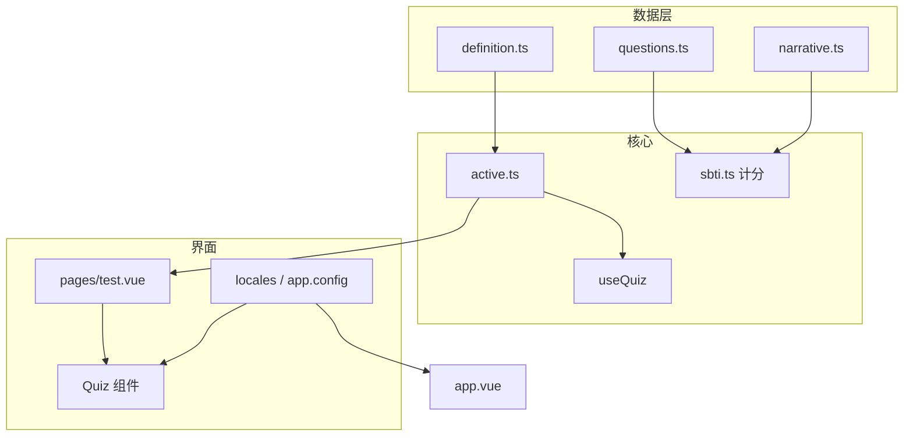

# 测验可插拔架构说明

本文说明当前项目中「题库 / 计分 / 输出 / 文案 / 站点信息 / 随机性 / 导出」的职责划分，以及更换题库或品牌时建议修改的文件，尽量做到**少侵入、可替换**。

## 目录结构（与测验相关）

| 路径                                | 职责                                                                            |
| ----------------------------------- | ------------------------------------------------------------------------------- |
| `app/types/quiz.ts`                 | 通用类型：`QuizDefinition`、`QuizQuestion`、`AnswerMap`、`QuizRuntimeModule` 等 |
| `app/quiz/active.ts`                | **当前启用的测验**：把「题库定义 + 计分函数」绑在一起；换测验主要改这里         |
| `app/data/sbti/questions.ts`        | SBTI 题库：题目、`sbtiScoreMap`、维度满分等                                     |
| `app/data/sbti/definition.ts`       | SBTI 的 `QuizDefinition`（默认分类名、选项顺序 A–D）                            |
| `app/data/sbti/narrative.ts`        | SBTI 叙事资源：鉴定书标题、彩蛋规则、结尾语池、主标签后缀等                     |
| `app/utils/sbti.ts`                 | SBTI 计分与生成 `SbtiResult`（含 `fullText`）                                   |
| `app/utils/random.ts`               | 可注入随机源：`mathRandomSource`、`createMulberry32`（便于单测或可复现）        |
| `app/utils/formatSbtiResult.ts`     | 结果导出：`plain`（与 `fullText` 一致）、`markdown`                             |
| `app/composables/useQuiz.ts`        | **通用测验流程**：进度、答案表、跳转，入参为 `QuizDefinition`                   |
| `app/composables/useAppStrings.ts`  | 界面文案：按 `useAppLocale()` 返回 `zh-CN` 或 `en-US` 文案对象                  |
| `app/composables/useAppLocale.ts`   | 语言 cookie（`sbti-locale`），`zh-CN` / `en-US`                                 |
| `app/composables/useAccentTheme.ts` | 强调色 cookie（`sbti-accent`），写入 `html[data-accent]`                        |
| `app/locales/zh-CN.ts`              | 中文文案（首页、关于、测验、导航等）                                            |
| `app/locales/en-US.ts`              | 英文文案（与 `AppMessages` 结构一致）                                           |
| `app/assets/css/main.css`           | `--sbti-*` 皮肤变量：明暗模式 + `data-accent` 换强调色                          |
| `app/app.config.ts`                 | `site`（品牌名、OG 图、GitHub 等）；标题与描述在 locales 的 `meta`              |

## 换题库（最小步骤）

1. **新增一套数据与定义**
   - 新建例如 `app/data/myquiz/questions.ts`（题目 + 若仍用键值打分则提供 score map）。
   - 新建 `app/data/myquiz/definition.ts`，导出符合 `QuizDefinition<你的选项联合类型>` 的对象（`optionOrder` 必须与每道题 `options` 的 key 一致）。

2. **实现计分与结果类型**
   - 新建 `app/utils/myquiz.ts`（或等价模块），实现与 `generateSbtiResult` 类似签名的函数：  
     `(answers, options?: { random?: { next: () => number } }) => TResult`。

3. **切换入口**
   - 修改 `app/quiz/active.ts`：改为导出你的 `definition` 与 `computeResult`，并满足 `QuizRuntimeModule<TOption, TResult>`。

4. **结果页**
   - 若结果结构不是 `SbtiResult`，需要新增对应展示组件（或在 `app/pages/test.vue` 里按 `activeQuiz.id` 分支渲染）。

5. **选项组件**
   - `QuizOptions` 已支持任意 `optionOrder`，无需再写死 A–D。

## 换打分规则（仍用 SBTI 题库）

- 数值规则：改 `app/data/sbti/questions.ts` 中的 `sbtiScoreMap`、`sbtiDimensionMaxScore`。
- 百分比抖动、主标签随机区间：改 `app/utils/sbti.ts`。
- 彩蛋阈值与文案、结尾语池、鉴定书标题：改 `app/data/sbti/narrative.ts`。

## 换输出文案（鉴定书 / 彩蛋 / 结尾）

- 结构化叙事与池子：`app/data/sbti/narrative.ts`。
- 拼接成长文 `fullText` 的逻辑：`app/utils/sbti.ts`。
- 分享用 Markdown：`app/utils/formatSbtiResult.ts`（`format === 'markdown'`）。

## 换界面语言或 Toast 文案

- 中文：`app/locales/zh-CN.ts`；英文：`app/locales/en-US.ts`（需与 `AppMessages` 结构一致）。
- `useAppStrings()` 根据 `useAppLocale()` 的 cookie（`sbti-locale`）返回对应文案。
- 导航栏右侧可切换 **中文 / EN**（`AppLocaleThemeControls`）。

## 全局主题（明暗 + 强调色，仅换肤）

- **明暗**：`nuxt.config` 中 `@nuxtjs/color-mode`（由 Nuxt UI 引入），默认 `dark`；用户在主题面板可选浅色 / 深色 / 跟随系统。
- **强调色**：`useAccentTheme()` 将选择写入 cookie `sbti-accent`，并在 `html` 上设置 `data-accent`（`lime` | `violet` | `cyan` | `amber`）。`app/assets/css/main.css` 内为各 accent 定义 `--sbti-accent`、`--sbti-accent-bright`、`--sbti-on-accent` 等。
- 页面与测验组件中的品牌色尽量使用 `var(--sbti-*)`，避免写死 hex，换肤时无需改结构。

## 换品牌与 SEO（与测验内容无关）

- 修改 `app/app.config.ts` 中的 `site`：`name`、`ogImage`、`githubUrl` 等。
- 默认标题与描述：`app/locales/*/meta`；`app/app.vue` 中 `useSeoMeta` 与 `html lang` 随当前语言变化。

## 随机性（测试与一致性）

- 默认使用 `mathRandomSource`（即 `Math.random`）。
- 调用计分时传入：

```ts
import { createMulberry32 } from '~/utils/random'

computeResult(answers, { random: createMulberry32(12345) })
```

可在单元测试中固定种子，使同样答案得到稳定输出（注意：仍包含设计上的随机项，如结尾语池抽样）。

## 依赖关系简图



## 校验

本地可执行：

```bash
pnpm run check
```

包含 Prettier、ESLint 与 `nuxt typecheck`。
